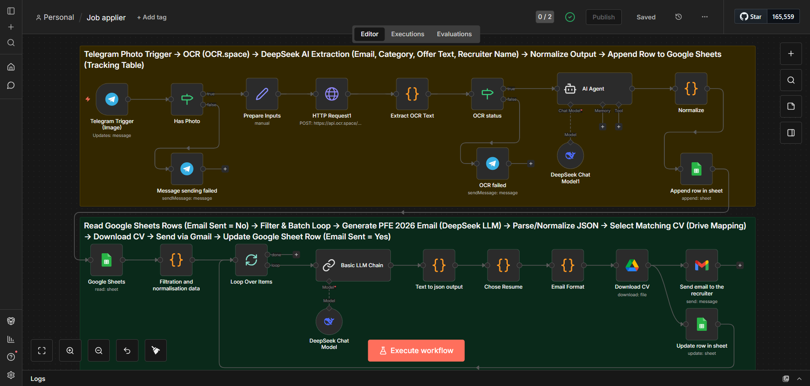
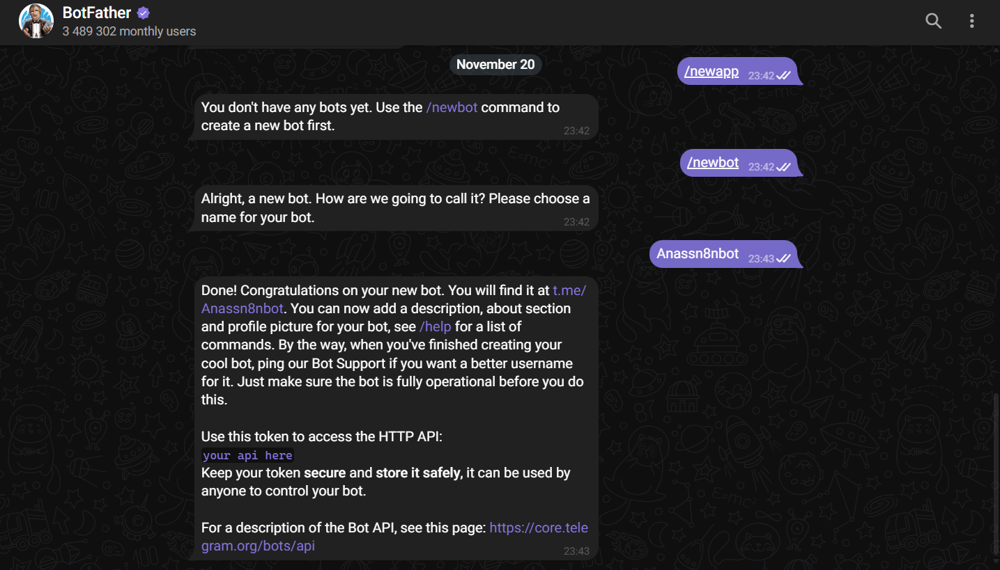
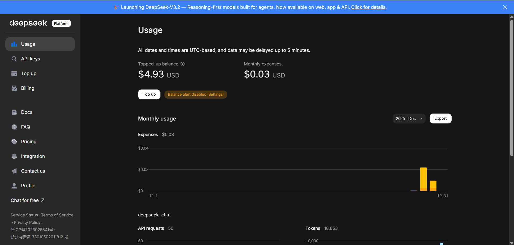

# 🚀 Automated Job Application Workflow (n8n + AI)

> **Automate the repetitive task of applying for PFE internships using Telegram, OCR, and DeepSeek AI.**

## 1. Project Overview

Finding a PFE internship often involves scrolling through LinkedIn or social media, spotting an image of a job offer, and manually writing an email. This workflow automates the entire process into two seamless parts:

1.  **Intake**: You send a screenshot of a job post to a Telegram Bot. The system extracts the text (OCR), analyzes it with AI to find the recruiter's email and job details, and saves it to a Google Sheet.
2.  **Apply**: The system reads the Google Sheet, generates a hyper-personalized email using DeepSeek LLM (matching the recruiter's language and tone), selects the correct CV file from your Drive, and sends the application via Gmail.

**What this repo contains:**
*   `README.md`: Complete setup documentation.
*   `workflow/job-applier.json`: The full n8n workflow file.
*   `.env.example`: Template for environment variables.
*   `docs/`: Screenshots and architectural diagrams.

---

## 2. Architecture

The automation is split into two logical flows within a single n8n workflow.

### 🔄 Data Flow

**Part A: Intake (The "Capture" Phase)**
`Telegram (Photo)` → `OCR.space API` (Image to Text) → `DeepSeek AI Agent` (Extract Info) → `Google Sheets` (Row Append)

**Part B: Apply (the "Action" Phase)**
`Google Sheets` (Read Rows) → `Filter` (Keep Unsent) → `DeepSeek LLM` (Write Email) → `Drive` (Select & Download CV) → `Gmail` (Send) → `Google Sheets` (Update Status)

### 🧩 Components
*   **Telegram**: Interface to trigger the workflow with a photo.
*   **OCR.space**: External API to convert images to raw text.
*   **n8n**: The orchestrator hosting the logic.
*   **DeepSeek LLM**: The brain (extracts data & writes emails).
*   **Google Sheets**: The database (tracks offers and status).
*   **Google Drive**: Storage for your CV PDF versions.
*   **Gmail**: Email sender.



---

## 3. Prerequisites

Before starting, ensure you have:
*   [n8n](https://n8n.io/) installed (Self-hosted via Docker is recommended) or n8n Cloud.
*   **Telegram Account**: To create a bot.
*   **OCR.space Free API Key**: [Get it here](https://ocr.space/ocrapi).
*   **DeepSeek API Key**: [Get it here](https://platform.deepseek.com/).
*   **Google Cloud Console Access**: To create OAuth credentials for Gmail, Drive, and Sheets.
*   **Dedicated Google Folder**: Store your CVs here (renamed clearly, e.g., `CV_DevOps.pdf`).

---

## 4. Installation & Boot

### Option A: n8n Cloud
Simply import the workflow JSON and set up credentials.

### Option B: Self-Hosted (Docker)
This is the recommended approach for full control.

> **💡 Hosting Tip:**
> *   **New Users**: Get **$200 free credit** for 2 months on DigitalOcean.
> *   **Students**: Get **$200 free credit** for 1 year via the [GitHub Student Developer Pack](https://education.github.com/pack).


1.  **Run n8n** (example `docker-compose.yml` snippet):
    ```yaml
    version: '3.1'
    services:
      n8n:
        image: n8nio/n8n
        ports:
          - "5678:5678"
        environment:
          - N8N_HOST=n8n.your-domain.com
          - WEBHOOK_URL=https://n8n.your-domain.com/
          - GENERIC_TIMEZONE=Europe/Paris
    ```
2.  Ensure you have **HTTPS** set up (required for Telegram webhooks).
3.  Access n8n at `https://n8n.your-domain.com`.

---

## 5. Credentials & APIs Setup

This is the most critical part. Follow carefully.

### 🤖 1. Telegram Bot
1.  Open Telegram and chat with `@BotFather`.
2.  Send `/newbot` and follow instructions.
3.  Copy the **HTTP API Token**.
4.  In n8n: **Credentials** → **Telegram API** → Paste token.


### 👁️ 2. OCR.space
1.  Register for a free key.
2.  Your key is a string (e.g., `K839...`).
3.  **Do not creates an n8n credential.** This key will be used as an Environment Variable (`OCR_SPACE_API_KEY`).


### 🧠 3. DeepSeek API
1.  Generate an API Key in DeepSeek platform.
2.  In n8n: **Credentials** → **DeepSeek API** → Paste key.
3.  Base URL is usually `https://api.deepseek.com`.


### ☁️ 4. Google Cloud (OAuth2)
*Required for: Gmail, Sheets, Drive.*

1.  Go to [Google Cloud Console](https://console.cloud.google.com/).
2.  **Create a Project** (e.g., "n8n-job-automation").
3.  **Enable APIs**: Search for and enable **Gmail API**, **Google Drive API**, and **Google Sheets API**.
4.  **OAuth Consent Screen**:
    *   Type: External (or Internal if you have a Workspace).
    *   Add Test Users: Add your own email.
5.  **Create Credentials**:
    *   Select **OAuth Client ID** → **Web Application**.
    *   **Redirect URIs**: Use the callback URL provided by your n8n credential window.
        *   Local: `http://localhost:5678/rest/oauth2-credential/callback`
        *   Production: `https://YOUR_DOMAIN/rest/oauth2-credential/callback`
6.  **Copy Client ID & Secret**.
7.  In n8n: **Credentials** → **Google OAuth2 API**:
    *   Paste ID and Secret.
    *   Scopes: Add `https://www.googleapis.com/auth/gmail.send`, `https://www.googleapis.com/auth/drive.readonly`, `https://www.googleapis.com/auth/spreadsheets`.
    *   Connect/Sign in with Google.


---

## 6. Google Sheets Schema

Create a new Google Sheet. You **must** have these exact header names in Row 1:

| Recruiter Email | Categorie | Job Offer Message | Recruiter Name | Email Sent |
| :--- | :--- | :--- | :--- | :--- |
| *(filled by AI)* | *(filled by AI)* | *(OCR Text)* | *(filled by AI)* | No |


**Optional but recommended columns:**
*   `Job Title`
*   `row_number` (Used by n8n for updates)

**Logic**: The workflow checks column `Email Sent`. If it is NOT "Yes", it proceeds to generate and send an email.

---

## 7. CV Mapping (Google Drive)

Your CVs must be hosted on Google Drive. The workflow maps the `Categorie` found by AI to a specific file ID.

**Supported Categories:**
*   `FullStack`
*   `DevOps`
*   `DataScience`
*   `DataEngineer`
*   `BusinessIntelligence`

**How to get File IDs:**
1.  Right-click your PDF in Drive → **Share** → **Copy Link**.
2.  The ID is the part between `d/` and `/view`.
    *   Example: `drive.google.com/file/d/1A2b3C.../view` → **ID**: `1A2b3C...`
3.  Add these IDs to your `.env` file (see Configuration).

---

## 8. Step-by-Step Node Walkthrough

### Part A: Intake (Telegram → Sheet)
1.  **Telegram Trigger**: Listens for incoming photos.
2.  **Has Photo**: Checks if the message actually contains an image. If not, replies asking for one.
3.  **HTTP Request (OCR)**: Sends the image to OCR.space to get raw text.
4.  **Extract OCR Text**: Cleans up the result. If text length < 10 chars, it triggers an error message.
5.  **AI Agent (DeepSeek)**: Analyzes the raw text to extract a JSON object containing: `RecruiterEmail`, `Categorie`, `JobOfferMessage`, etc.
6.  **Normalize**: Ensures the JSON structure is flat and valid.
7.  **Append row in sheet**: Adds the extracted data to the bottom of your configured Google Sheet.

### Part B: Apply (Sheet → Gmail)
1.  **Google Sheets**: Reads all rows.
2.  **Filter**: Keeps only rows where `Email Sent` is NOT "Yes" AND `Recruiter Email` exists.
3.  **Loop Over Items**: Processes one job offer at a time.
4.  **Basic LLM Chain**: Writes the email body. It adapts to the language (EN/FR) and tone of the offer.
5.  **Text to JSON**: Ensures the LLM output is valid JSON.
6.  **Chose Resume**: Matches the `cv_category` (e.g., "devops") to the correct Drive File ID.
7.  **Email Format**: Prepares HTML line breaks (`<br>`) for Gmail.
8.  **Download CV**: Downloads the actual PDF binary data from Drive.
9.  **Send Email**: Sends the email via Gmail with the PDF attachment.
10. **Update row**: Marks `Email Sent` as "Yes" in the sheet to prevent duplicates.

---

## 9. Configuration & Operations

### Environment Variables (.env)
Create a `.env` file in your n8n root or Docker setup:

```ini
GSHEET_OFFERS_ID=your_google_sheet_id
OCR_SPACE_API_KEY=your_ocr_key
CV_FULLSTACK_FILE_ID=your_id
CV_DEVOPS_FILE_ID=your_id
# ... add other IDs
```

### Rate Limits & Safety
*   **Testing**: When setting up, pause the workflow after the "Filter" node to ensure you don't accidentally email real people.
*   **Batching**: If applying to many roles, n8n processes them sequentially.
*   **Daily Quotas**: Gmail has sending limits (approx 500/day for personal accounts), which is plenty for this use case.

### Observability
*   **Validating Intake**: Check your Google Sheet to see if new rows appear after sending a Telegram photo.
*   **Validating Sends**: Check your "Sent" folder in Gmail.

---

## 10. Security & Publishing

> **⚠️ IMPORTANT: DO NOT COMMIT SECRETS**

If you fork this repository:
1.  **Never** commit your `.env` file.
2.  **Sanitize** the workflow JSON:
    *   Remove hardcoded credentials.
    *   Replace your personal Request URLs with placeholders.
    *   Verify `webhookId` fields are regenerated or redacted.

Use the provided `.env.example` as a template for public sharing.

---

## 11. Troubleshooting

| Issue | Possible Cause | Fix |
| :--- | :--- | :--- |
| **Telegram not triggering** | Webhook URL mismatch | Ensure `WEBHOOK_URL` is https and accessible from internet. |
| **OCR returns garbage** | Low image quality | Try cropping the screenshot to just the text area. |
| **Gmail Auth Error** | Token expired or Test Mode | If app is in "Testing" mode in Google Cloud, refresh token every 7 days. |
| **Wrong CV sent** | Categorie mismatch | Check if AI extracted category matches your mapped keys (e.g. "DevOps" vs "Dev Ops"). |
| **Sheet not updating** | Row mismatch | Ensure `row_number` logic or loop index is correct. |

---

## Screenshots Checklist
*   [x] `docs/screenshots/workflow-overview.png` (Full canvas view)
*   [x] `docs/screenshots/telegram-interaction.png` (Chat interaction)
*   [x] `docs/screenshots/google-sheets-schema.png` (Columns view)
*   [x] `docs/screenshots/digital-ocean-setup.png` (Hosting)
*   [x] `docs/screenshots/gcp-setup.png` (GCP)
*   [x] `docs/screenshots/deepseek-setup.png` (AI)

---

**License**: MIT
